# Comparison graph for X-CUBE-AI-7.3 vs X-CUBE-AI-8.0 by Krai 

## NUCLEO_H7A3ZI 
### Performance
This graph shows performance comparisons with X-CUBE-AI on NUCLEO_H7A3ZI board for four Tiny ML benchmarks

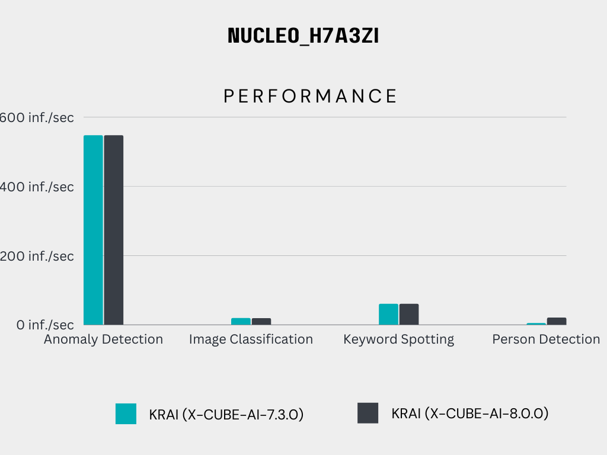

### Acuuracy
This graph shows accuracy comparisons with X-CUBE-AI on NUCLEO_H7A3ZI board for four Tiny ML benchmarks 

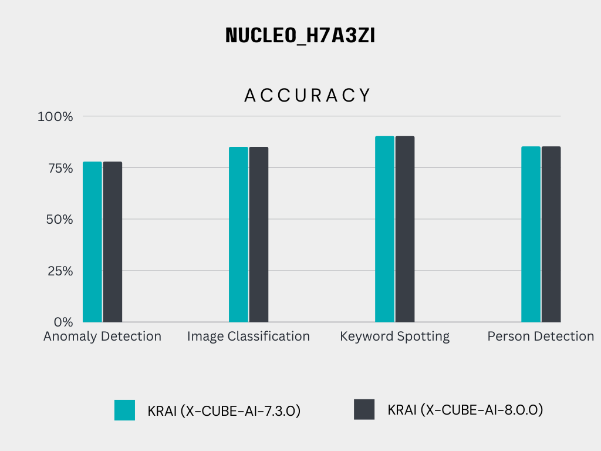

### Energy
This graph shows energy comparisons with X-CUBE-AI on NUCLEO_H7A3ZI board for three Tiny ML benchmarks 

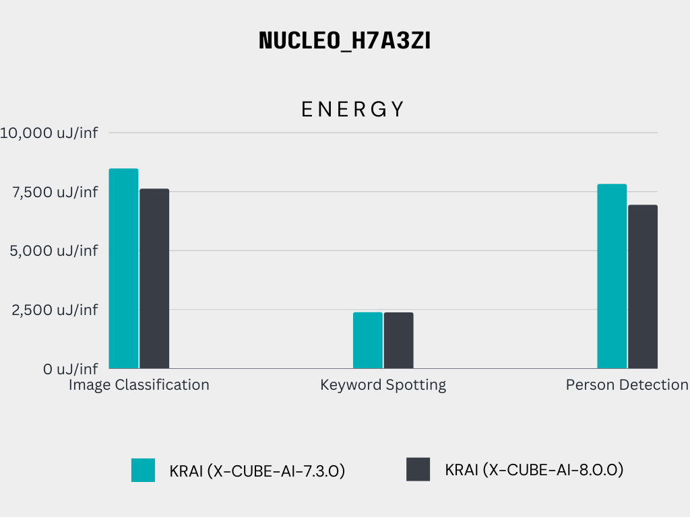

# Comparison graph for X-CUBE-AI-7.3 vs X-CUBE-AI-8.0 by Krai 

## NUCLEO_L4R5ZI 
### Performance
This graph shows performance comparisons with X-CUBE-AI for four Tiny ML benchmarks

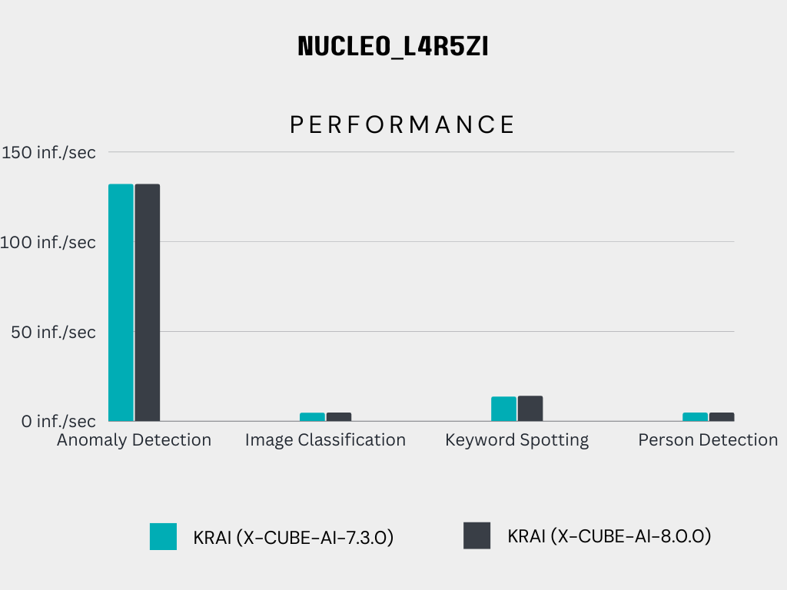

### Acuuracy
This graph shows accuracy comparisons with X-CUBE-AI for four Tiny ML benchmarks 

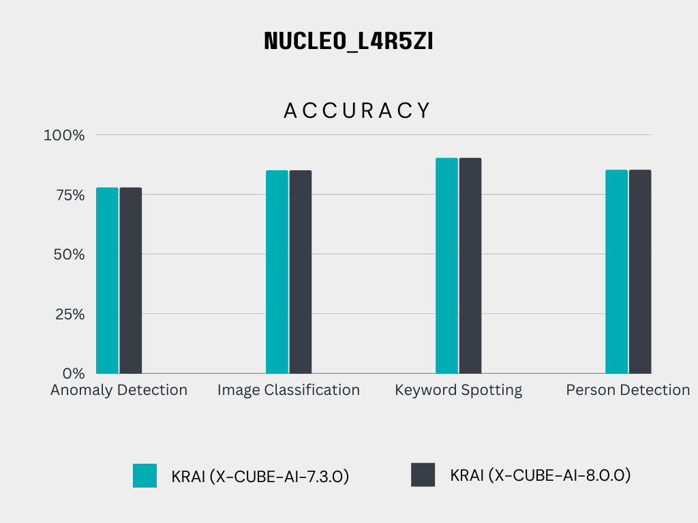

### Energy
This graph shows energy comparisons with X-CUBE-AI for four Tiny ML benchmarks 

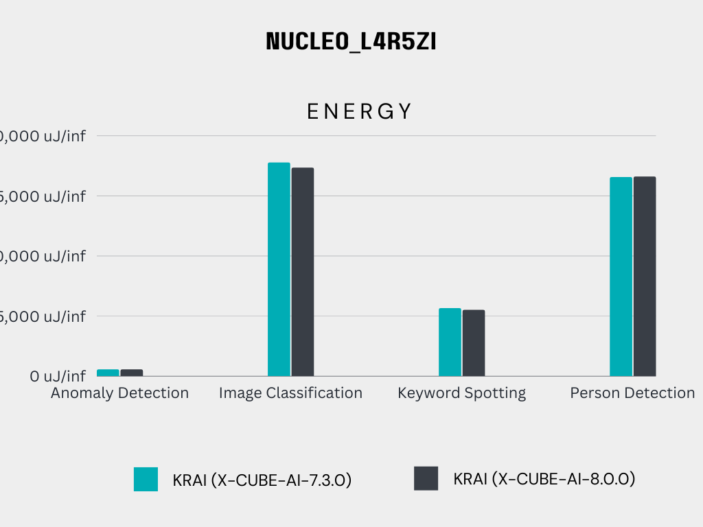

# Comparison graph for MLPerf Tiny v1.0 by STMicroelectronics vs Krai using X-CUBE-AI-7.3 

## NUCLEO_H7A3ZI 
### Performance
This graph shows performance value comparison for Krai's MLPerf Tiny v1.1 submission with the original submitter's v1.0 submission 

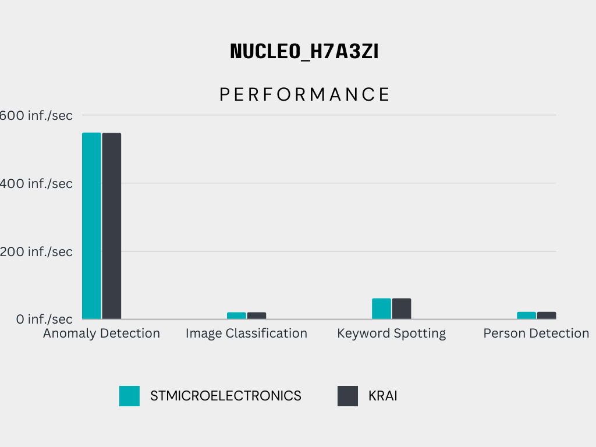

### Accuracy 
This graph shows accuacy value comparison for Krai's MLPerf Tiny v1.1 submission with the original submitter's v1.0 submission  

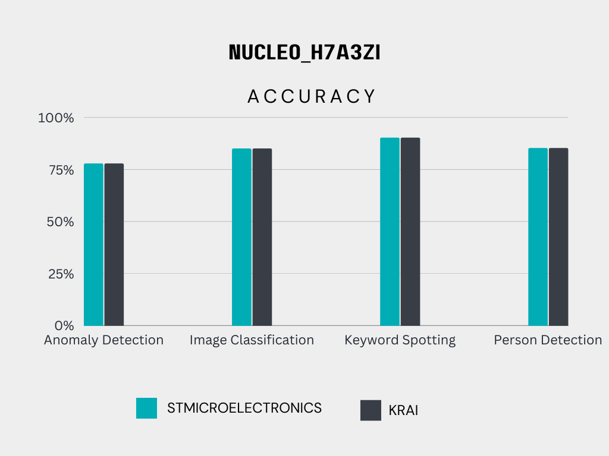

### Energy
This graph shows energy value comparison for Krai's MLPerf Tiny v1.1 submission with the original submitter's v1.0 submission 

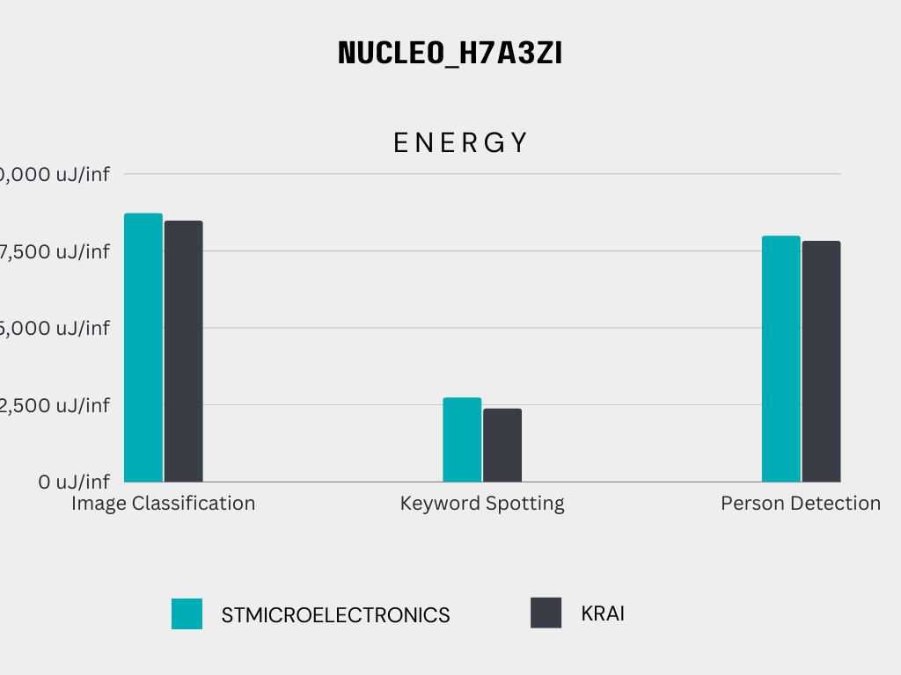

# Comparison graph for MLPerf Tiny v1.0 by STMicroelectronics vs Krai using X-CUBE-AI-7.3

## NUCLEO_L4R5ZI 
### Performance
This graph shows performance value comparison for Krai's MLPerf Tiny v1.1 submission with the original submitter's v1.0 submission 

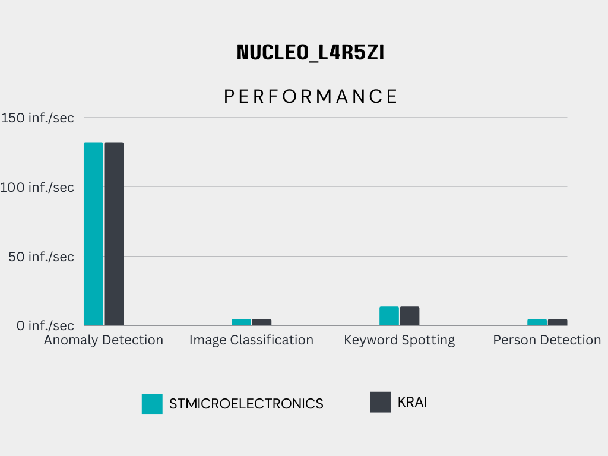

### Accuracy 
This graph shows accuacy value comparison for Krai's MLPerf Tiny v1.1 submission with the original submitter's v1.0 submission  

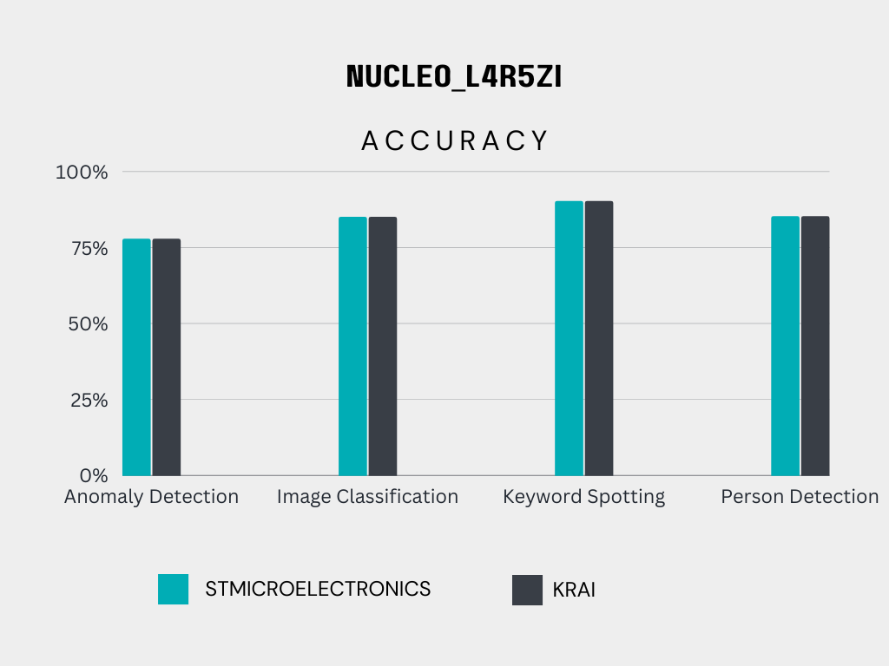

### Energy
This graph shows energy value comparison for Krai's MLPerf Tiny v1.1 submission with the original submitter's v1.0 submission  

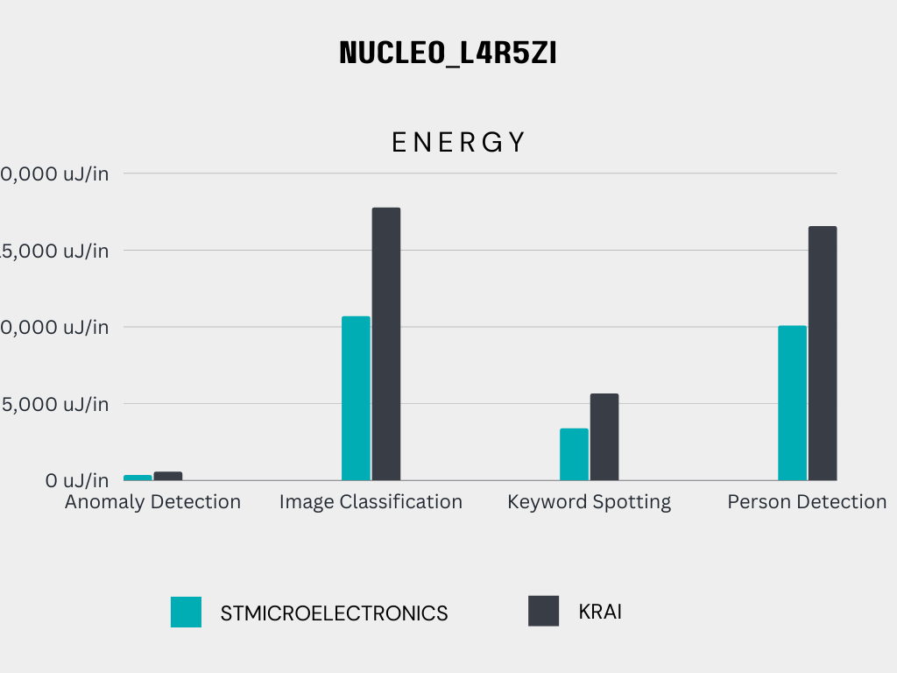

**Note:**  The energy measurement was conducted at a voltage of 3.0 volts. It should be noted that using different voltages may lead to variations in the energy values obtained.

 The given graph represents energy values in relation to the squared voltage at specific voltage levels. The squared voltages considered are (2.5&#178;) volts, (3.0&#178;) volts, and (3.3&#178;) volts. Based on this data, after applying a logarithmic transformation and performing linear regression analysis, the predicted energy for the Image Classification model at a voltage of (1.8&#178;) volts is 10,321.44 uJ/inf. 

# Comparison graph for MLPerf Tiny v1.0 by OctoML vs Krai using Microtvm cmsis_nn package 

## NUCLEO_L4R5ZI 
### Performance
This graph shows performance value comparison for Krai's MLPerf Tiny v1.1 submission with the original submitter's v1.0 submission 

-Octoml-vs-Krai.png)

### Accuracy 
This graph shows accuacy value comparison for Krai's MLPerf Tiny v1.1 submission with the original submitter's v1.0 submission 

-Octoml-vs-Krai.png)

# Comparison graph for MLPerf Tiny v1.0 by OctoML vs Krai using Microtvm cmsis_nn package 

## NRF5340-DK 
### Performance
This graph shows performance value comparison for Krai's MLPerf Tiny v1.1 submission with the original submitter's v1.0 submission 

-Octoml-vs-Krai.png)

### Accuracy 
This graph shows accuacy value comparison for Krai's MLPerf Tiny v1.1 submission with the original submitter's v1.0 submission 

-Octoml-vs-Krai.png)

# Comparison graph for MLPerf Tiny v1.0 by OctoML vs Krai using Microtvm native package 

## NUCLEO_L4R5ZI
### Performance
This graph shows performance value comparison for Krai's MLPerf Tiny v1.1 submission with the original submitter's v1.0 submission 

-Octoml-vs-Krai.png)

### Accuracy 
This graph shows accuacy value comparison for Krai's MLPerf Tiny v1.1 submission with the original submitter's v1.0 submission 

-Octoml-vs-Krai.png)