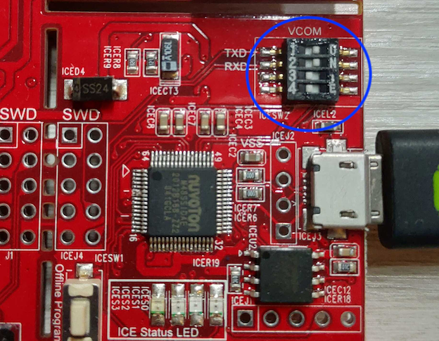

# MLPerf™ Tiny Benchmarking with Nuvoton

Tiny ONNC is a user-friendly AI toolchain designed for deploying neural network models onto microcontrollers. It accomplishes this by generating a sequence of function calls that leverage neural network libraries. This submission specifically focuses on Arm Cortex-M microcontrollers, utilizing the CMSIS-NN library as the neural network library of choice. The CMSIS-NN library offers integer version of computation for widely used neural network operators. To ensure an optimal model accuracy, Tiny ONNC has developed a post-training quantization (PTQ) engine that aligns with the quantization scheme employed by the library.

The compiled result has been successfully ported to Zephyr OS. This guide provides step-by-step instructions to reproduce the results presented in this submission. Please note that the instructions provided have been tested on Ubuntu 20.04 Desktop.

This benchmark suggests this board: [NuMaker-M467HJ](https://www.nuvoton.com/board/numaker-m467hj/).

# Zephyr OS on NUMAKER_M467HJ
## Environment setup
1. Install python package
```bash
WS=`pwd`
bash envsetup-zephyr.sh
python3 -m venv venv_zephyr
source venv_zephyr/bin/activate
pip3 install wheel==0.38.4
pip3 install -r requirements-zephyr.txt
```
2. [Install Zephyr](https://docs.zephyrproject.org/2.7.0/getting_started/index.html)
```bash
# init Zephyr project with correct version
west init --mr v2.7-branch "${WS}/zephyrproject" # this could take a while since it downloads a large repository

# setup Zephyr environment
cd ${WS}/zephyrproject/zephyr
# Use nuvoton's specific branch
git remote add m467 https://github.com/OpenNuvoton/zephyr.git
git fetch m467
git checkout m467/nvt_m467
cd ${WS}/zephyrproject
west update # this could take a while since it will update the submodules to the correct version
west zephyr-export
pip3 install -r ${WS}/zephyrproject/zephyr/scripts/requirements.txt
# Change modules/hal/nuvoton/
cd ${WS}/zephyrproject/modules/hal/nuvoton/
git remote add m467 https://github.com/OpenNuvoton/hal_nuvoton.git
git fetch m467
git checkout m467/nvt_m467

# Install zephyr-sdk-0.15.2
cd ${WS}
wget https://github.com/zephyrproject-rtos/sdk-ng/releases/download/v0.15.2/zephyr-sdk-0.15.2_linux-x86_64.tar.gz
wget -O - https://github.com/zephyrproject-rtos/sdk-ng/releases/download/v0.15.2/sha256.sum | shasum --check --ignore-missing
tar xvf zephyr-sdk-0.15.2_linux-x86_64.tar.gz
cd zephyr-sdk-0.15.2
./setup.sh

# export required environment variables
export ZEPHYR_BASE="${WS}/zephyrproject/zephyr"
export PATH="${PATH}:${WS}/zephyr-sdk/sysroots/x86_64-pokysdk-linux/usr/bin"
export ZEPHYR_TOOLCHAIN_VARIANT=zephyr
export ZEPHYR_SDK_INSTALL_DIR="${WS}/zephyr-sdk-0.15.2"
```
3. Download CMSIS

```bash
cd ${WS}
git clone https://github.com/ARM-software/CMSIS_5.git
cd CMSIS_5
git checkout b966796
cp ${WS}/arm_convolve_HWC_q7_fast_nonsquare.fixed CMSIS/NN/Source/ConvolutionFunctions/arm_convolve_HWC_q7_fast_nonsquare.c
export CMSIS_PATH=`pwd`
```

## Build image
```bash
BENCHMARK=${WS}/NUMAKER_M467HJ-zephyr/<MODEL>
cd ${BENCHMARK}
bash build.sh
```

Where MODEL is one of {ad, ic, kws, vww}.

The ONNC's generated code can be found in the `ad01_code`, `ic01_code`, `kws01_code`, and `vww01_code` folders.

## Deploy image to board
For the initial use of this board, you need to turn the VCOM switch to `ON` to enable micro-USB transmission.



Connect your board (NUMAKER_M467HJ) to your computer using a micro-USB to USB cable, and enter the command:
```bash
cp ${BENCHMARK}/build/zephyr/zephyr.bin <your-board-path>
```
your-board-path may appear at `/media/$USER`

Now your board is ready for benchmarking.

# Benchmark by using energy runner
You can [download energy runner](https://www.eembc.org/energyrunner/mlperftiny/) mentioned from [its repo](https://github.com/eembc/energyrunner), and extract it

```bash
mkdir ${WS}/EnergyRunner_MLPerfTiny
mv EnergyRunner_MLPerfTiny_Linux.tar.gz ${WS}/EnergyRunner_MLPerfTiny
cd ${WS}/EnergyRunner_MLPerfTiny
tar zxvf EnergyRunner_MLPerfTiny_Linux.tar.gz
```

The EnergyRunner reads the dataset from `$USER/eembc/runner/benchmarks/ulp-mlperf/datasets/`, so you will need to copy the test dataset to this location.

You can find the test data in the datasets directory of the [EnergyRunner repository](https://github.com/eembc/energyrunner/tree/main/datasets). Alternatively, you can generate the test data using the [provided source scripts](https://github.com/mlcommons/tiny/tree/master/benchmark/training).

```
sudo mkdir -p /root/eembc/runner/benchmarks/ulp-mlperf/datasets/
# Copy test data to /root/eembc/runner/benchmarks/ulp-mlperf/datasets/
```

- NOTE: Since the kws test data is scaled and shifted using ONNC's scale/shift, the test data generated by using the [provided source scripts](https://github.com/mlcommons/tiny/tree/master/benchmark/training/keyword_spotting) should apply the same scale/shift from the `onnc_get_io_scaling_factors` function in `kws01_code/onnc_main.cpp`.


Then start the energy runner
```
sudo ${WS}/EnergyRunner_MLPerfTiny/benchmark-framework --no-sandbox
```
## 1. Get performance
1. choose `ML Performance 1.0.1`
2. click `Setup`
3. set `Inference Iterations`, recommand value is
    - ad01: 4000
    - ic01: 80
    - kws01: 400
    - vww01: 160
4. click `Median Performance`
5. click `Initialize`
6. click `Run`

Then, you will be able to view the performance metrics in the console located below.
```
00025.209 ulp-mlperf:   Runtime      :       xxx sec.
00025.209 ulp-mlperf:   Throughput   :       xxx inf./sec.
```
## 2. Get precision
1. choose `ML Performance 1.0.1`
2. choose `Accuracy`
3. click `Initialize`
4. click `Run`

Then, you will be able to view the accuracy metrics in the console located below.
```
00405.539 ulp-mlperf: Top-1: xxx%
00405.566 ulp-mlperf: AUC: xxx
```
