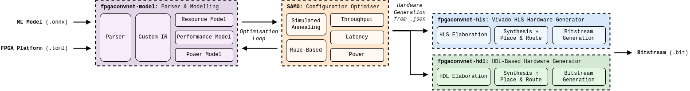

fpgaConvNet is a toolflow for automating the design of accelerators for a specific FPGA and ML model pair.
The tool takes an ML model, and given the constraints of the platform, automatically searches the design space to find the best design for a given objective (throughput, latency, power).
The general flow is illustrated in the figure below. 
The core components to the toolflow are:

- __[fpgaconvnet-model](https://github.com/AlexMontgomerie/fpgaconvnet-model):__ a parser and modelling framework for representing the configurable hardware design of a given ML model.
- __[samo](https://github.com/AlexMontgomerie/samo):__ an optimisation framework for tuning the hardware parameters of the design for a given objective.
- __[fpgaconvnet-hls](https://github.com/AlexMontgomerie/fpgaconvnet-hls):__ an open-source ML hardware generation  tool that accepts fpgaconvnet configurations to generate bitstreams using Vivado-HLS. 
- __fpgaconvnet-hdl:__ a closed-source ML hardware generation tool with that accepts fpgaconvnet configurations to generate bitstreams using Vivado-HLS. 

This submissions uses the fpgaconvnet-hdl backend for generating bitstreams.



There is a [tutorial](https://github.com/AlexMontgomerie/fpgaconvnet-tutorial) for using the whole pipeline with the hls backend if you wish to use the tool yourself.

## Setup

To reproduce the results, you will need the following software:

- Xilinx SDK 2019.1
- Python 3.10

The necessary python packages can be installed using the `requirements.txt` file:

```
python -m pip install -r requirements.txt
```

To produce the configuration files, you will need the [fpgaconvnet-model](https://github.com/AlexMontgomerie/fpgaconvnet-model) python library, in particular the `mlperf` branch of this repo. 
This can be done using the following commands:

```
git clone https://github.com/AlexMontgomerie/fpgaconvnet-model
cd fpgaconvnet-model
git fetch
git checkout mlperf
python -m pip install .
```

## Hardware Information

These tables give a breakdown of the hardware resources used by the FPGA accelerators. 
All designs were generated using Vivado 2019.1.

### ZedBoard

| Task | LUT       | FF        | DSP       | BRAM      | Freq. (MHz) |
|------|-----------|-----------|-----------|-----------|:-------------:|
| IC   | 47K (89%) | 42K (39%) | 211 (96%) | 93 (66%)  | 143         |
| VWW  | 34K (64%) | 36K (34%) | 189 (86%) | 123 (88%) | 111         |
| KWS  | 37K (69%) | 37K (35%) | 188 (86%) | 97 (69%)  | 143         |

### ZC706

| Task | LUT       | FF        | DSP      | BRAM     | Freq. (MHz) |
|------|-----------|-----------|----------|----------|:-------------:|
| IC   | 108K (49%) | 99K (23%) | 525 (58%) | 28 (55%) | 187         |
| VWW  | 133K (61%) | 124K (28%) | 564 (63%) | 366 (67%) | 200         |


### ZyBo

| Task | LUT       | FF        | DSP      | BRAM     | Freq. (MHz) |
|------|-----------|-----------|----------|----------|:-------------:|
| IC   | 16K (91%) | 16K (44%) | 78 (98%) | 36 (60%) | 125         |
| KWS  | 15K (85%) | 17K (49%) | 60 (75%) | 16 (27%) | 125         |

### Cora-Z7

| Task | LUT       | FF        | DSP       | BRAM      | Freq. (MHz) |
|------|-----------|-----------|-----------|-----------|:-------------:|
| KWS  | 13K (89%) | 13K (44%) | 55 (92%)  | 28 (55%)  | 143         |


## Quantisation

The hardware uses INT8 quantised models from the [mlcommons-tiny](https://github.com/mlcommons/tiny) repo. However, as the hardware only supported signed representations for feature-maps, an extra bit (INT9) representation is used. 
Furthermore, partial results are accumulated with a 24-bit representation rather than 32-bits.

## Contributors

- Alexander Montgomerie-Corcoran (am9215 [at] ic.ac.uk)
- Zhewen Yu (zhewen.yu18 [at] imperial.ac.uk)

## Acknowledgements

We would like to acknowledge previous submitters, in particular HLS4ML and FINN, whose submission code has been a very useful guide for us. 

